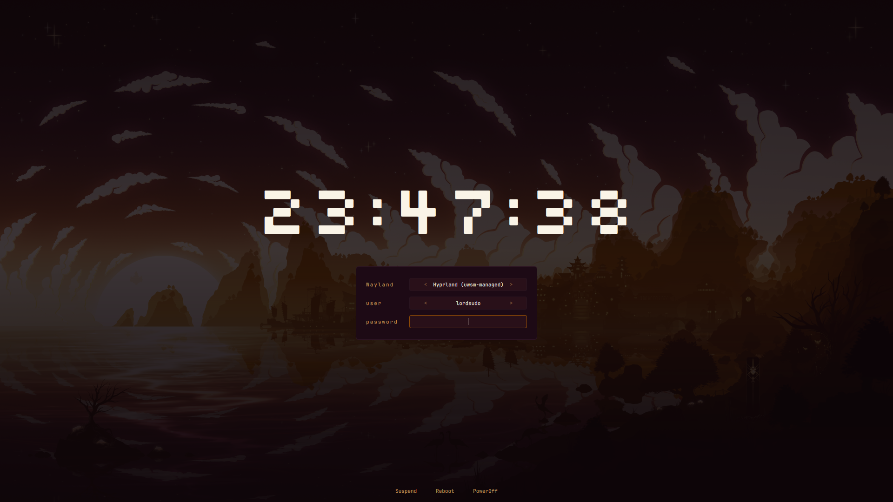

# qext-sddm

Retro pixel-style SDDM login theme. Dark plum background, Silkscreen pixel clock, burnt orange & warm gold accents, Hyprland-first session picker, and a terminal-log overlay for login and system actions.



## Features

- **Pixel clock** — Silkscreen font with large centered time display
- **Warm palette** — burnt orange (`#914C05`) and warm gold (`#C68C4F`) accents on dark plum background
- **Hyprland-first** — auto-selects the Hyprland session if available
- **Terminal-log overlay** — simulated `[  OK  ]` / `[ FAIL ]` log lines appear during login, suspend, reboot, and poweroff
- **Resolution-aware scaling** — sizes scale to fit the screen while respecting configurable caps
- **Single-file** — the entire theme is one `Main.qml`, easy to hack on

## Quick start

```bash
git clone https://github.com/xuanz-ai/qext-sddm.git
cd qext-sddm
./test-sddm
```

That's it — the script installs the theme and opens SDDM greeter in test mode so you can preview immediately. No logout needed.

## Permanent install

```bash
sudo cp -r . /usr/share/sddm/themes/qext-sddm/
```

Then set the theme in `/etc/sddm.conf`:

```ini
[Theme]
Current=qext-sddm
```

## Touchpad tap-to-click

SDDM greeter runs in its own session and doesn't inherit your desktop's touchpad settings. If tap-to-click doesn't work on the lock screen:

```bash
sudo ./install-touchpad-fix
sudo systemctl restart sddm
```

This creates `/etc/X11/xorg.conf.d/30-touchpad.conf` with libinput tap-to-click enabled.

## Requirements

- SDDM (greeter tested with both Qt5 and Qt6)
- JetBrains Mono (`/usr/share/fonts/TTF/JetBrainsMono-*.ttf`) — falls back to system monospace if missing

## File structure

| File | Purpose |
|---|---|
| `Main.qml` | Entire theme — layout, styling, logic |
| `theme.conf` | SDDM metadata (background, blur toggle) |
| `fonts/Silkscreen-*.ttf` | Pixel clock font |
| `mountain-night.jpg` | Default background |
| `test-sddm` | Install + preview script |
| `install-touchpad-fix` | Enable tap-to-click on SDDM lock screen |

## Customizing

All styling is in `Main.qml`. Key values near the top:

- **Colors** — look for hex strings (`#C68C4F`, `#0E0508`, `#914C05`, etc.)
- **Sizing** — the `sc` property drives all scaling; individual base sizes are hardcoded multipliers (e.g. `380 * root.sc` for panel width)
- **Font sizes** — `Math.min(root.width * 0.10, 150)` for the clock, `11 * root.sc` for body text

After editing, run `./test-sddm` again to preview your changes.

## License

MIT
